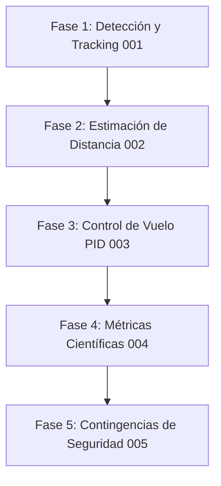

# Roadmap - Quillinchu AI

Este documento detalla la hoja de ruta y las fases de desarrollo del proyecto para el seguimiento autónomo de personas mediante drones en el LabIAR - UNI.

## 📌 Fases del Proyecto

---

### 🟢 Fase 1: Detección y Tracking (spec/features/001)
- [ ] Implementar captura asíncrona de video desde el stream UDP de Rosetta Drone (Puerto 5600) / RTSP del DJI Air 2S.
- [ ] Integrar el modelo de detección `HeadDetect.pt` usando YOLOv8.
- [ ] Configurar Deep SORT para el seguimiento continuo con asignación de IDs únicos.
- [ ] Diseñar el pipeline asíncrono Productor-Consumidor para desacoplar el procesamiento de imágenes del lazo de control.

### 🟡 Fase 2: Estimación de Distancia (spec/features/002)
- [ ] Modelar matemáticamente la estimación de distancia basada en el tamaño proyectado de la cabeza (~0.23 m de diámetro promedio).
- [ ] Evitar asumir la altura total del cuerpo (1.68 m) para la calibración del modelo de distancia.
- [ ] Realizar pruebas de calibración geométrica y validación de distancias estimadas.

### 🟡 Fase 3: Control de Vuelo PID (spec/features/003)
- [ ] Desarrollar controladores PID independientes para el control de actitud y posición del dron.
- [ ] Implementar traducción de comandos de velocidad al sistema de coordenadas local del dron (`BODY_NED`).
- [ ] Integración con la API asíncrona de MAVSDK-Python.

### 🔴 Fase 4: Métricas Científicas (spec/features/004)
- [ ] Implementar el logging de telemetría y eventos de tracking en tiempo real (formatos CSV/JSON).
- [ ] Desarrollar `src/metrics/report_generator.py` para calcular automáticamente:
  - Frecuencia de actualización del sistema (Hz).
  - Latencia punta a punta.
  - Error Cuadrático Medio (RMSE) en posición y velocidad.

### 🔴 Fase 5: Contingencias y Seguridad de Vuelo (spec/features/005)
- [ ] Implementar límites de saturación física de velocidad y aceleración.
- [ ] Configurar Geofencing dinámico tridimensional.
- [ ] Programar lógica de hovering (vuelo estacionario) inmediato y seguro en caso de pérdida prolongada del objetivo de tracking.
